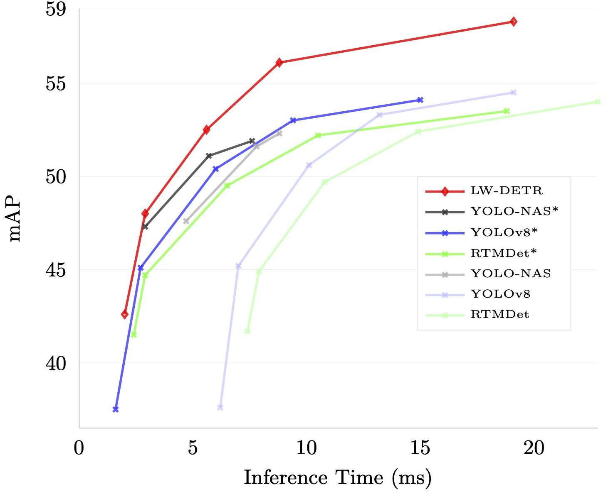

# LW-DETR: A Transformer Replacement to YOLO for Real-Time Detection

This is the *official* repository with PyTorch implementation of [LW-DETR: A Transformer Replacement to YOLO for Real-Time Detection](https://arxiv.org/pdf/2406.03459v1).

☀️ If you find this work useful for your research, please kindly star our repo and cite our paper! ☀️

## Highlights
- Release a series of real-time detection models in LW-DETR, including LW-DETR-tiny, LW-DETR-small, LW-DETR-medium, LW-DETR-large and LW-DETR-xlarge, named <LWDETR_*size_60e_coco.pth>. Please refer to [Hugging Face](https://huggingface.co/xbsu/LW-DETR/tree/main/pretrain_weights) to download.
- Release a series of pretrained models in LW-DETR. Please refer to [Hugging Face](https://huggingface.co/xbsu/LW-DETR/tree/main/pretrain_weights) to download.

## News
[🔥2025/02/18] We release a demo script to test LW-DETR. Please refer to [Section 4](https://github.com/Atten4Vis/LW-DETR/blob/main/README.md#4).

[2024/07/15] We present [OVLW-DETR](https://arxiv.org/pdf/2407.10655), an efficient open-vocabulary detector with outstanding performance and low latency, built upon LW-DETR. It surpasses existing real-time open-vocabulary detectors on the standard Zero-Shot LVIS benchmark. 
The source code and pre-trained model is comming soon, please stay tuned!

## Catalogue

- [1. Introduction](#1)
- [2. Installation](#2)
- [3. Preparation](#3)
- [4. Inference Demo with Pre-trained Model](#4)
- [5. Train](#5)
- [6. Eval](#6)
- [7. Deploy](#7)
- [8. Main Results](#8)
- [9. References](#9)
- [10. Citation](#10)

<a name='1'></a>

## 1. Introduction

LW-DETR is a light-weight detection tranformer, which outperforms YOLOs for real-time object detection. The architecture is a simple stack of a ViT encoder, a projector, and a shallow DETR decoder. LW-DETR leverages recent advanced techniques, such as training-effective techniques, e.g., improved loss and pretraining, and interleaved window and global attentions for reducing the ViT encoder complexity. LW-DETR improves the ViT encoder by aggregating multi-level feature maps, and the intermediate and final feature maps in the ViT encoder, forming richer feature maps, and introduces window-major feature map organization for improving the efficiency of interleaved attention computation. LW-DETR achieves superior performance than on existing real-time detectors, e.g., YOLO and its variants, on COCO and other benchmark datasets. 

<p align="center">
  
</p>


<a name='2'></a>

## 2. Installation

### Requirements
The code is developed and validated under ```python=3.8.19, pytorch=1.13.0, cuda=11.6,TensorRT-8.6.1.6```. Higher versions might be available as well.

1. Create your own Python environment with [Anaconda](https://www.anaconda.com/download).
```shell
conda create -n lwdetr python=3.8.19
conda activate lwdetr
```

2. Clone this repo.
```shell
git clone https://github.com/Atten4Vis/LW-DETR.git
cd LW-DETR
```

3. Install PyTorch and torchvision.

Follow the instruction on https://pytorch.org/get-started/locally/.
```shell
# an example:
conda install pytorch==1.13.0 torchvision==0.14.0 pytorch-cuda=11.6 -c pytorch -c nvidia
```

4. Install required packages.

For training and evaluation:
```shell
pip install -r requirements.txt
```
For deployment:

Please refer to [NVIDIA](https://docs.nvidia.com/deeplearning/tensorrt/archives/tensorrt-861/install-guide/index.html) for installation instruction of TensorRT
```shell
pip install -r deploy/requirements.txt
```

5. Compiling CUDA operators
```shell
cd models/ops
python setup.py build install
# unit test (should see all checking is True)
python test.py
cd ../..
```


<a name='3'></a>

## 3. Preparation

### Data preparation
For **MS COCO** dataset, please download and extract COCO 2017 train and val images with annotations from
[http://cocodataset.org](http://cocodataset.org/#download).
We expect the directory structure to be the following:
```
COCODIR/
  ├── train2017/
  ├── val2017/
  └── annotations/
  	├── instances_train2017.json
  	└── instances_val2017.json
```

For **Objects365** dataset for pretraining, please download Objects365 images with annotations from
[https://www.objects365.org/overview.html](https://www.objects365.org/download.html).


### Model preparation

All the checkpoints can be found in [Hugging Face](https://huggingface.co/xbsu/LW-DETR/tree/main/pretrain_weights).

1. Pretraining on Objects365.

- Pretrained the ViT. 

We pretrain the ViT on the dataset Objects365 using a MIM method, CAE v2, based on the pretrained models. Please refer to the following link to download the pretrained models, and put them into `pretrain_weights/`.

| Model  | Comment |
|--------|-----------|
| [caev2_tiny_300e_objects365](https://huggingface.co/xbsu/LW-DETR/resolve/main/pretrain_weights/caev2_tiny_300e_objects365.pth?download=true) | pretrained ViT model on objects365 for LW-DETR-tiny/small using [CAE v2](https://github.com/Atten4Vis/CAE/tree/master/project/CAEv2) |
| [caev2_tiny_300e_objects365](https://huggingface.co/xbsu/LW-DETR/resolve/main/pretrain_weights/caev2_small_300e_objects365.pth?download=true) | pretrained ViT model on objects365 for LW-DETR-medium/large using CAE v2 |
| [caev2_tiny_300e_objects365](https://huggingface.co/xbsu/LW-DETR/resolve/main/pretrain_weights/caev2_base_300e_objects365.pth?download=true) | pretrained ViT model on objects365 for LW-DETR-xlarge using CAE v2 |

- Pretrained LW-DETR. 

We retrain the encoder and train the projector and the decoder on Objects365 in a supervision manner. Please refer to the following link to download the pretrained models, and put them into `pretrain_weights/`.

| Model  | Comment |
|--------|-----------|
| [LWDETR_tiny_30e_objects365](https://huggingface.co/xbsu/LW-DETR/resolve/main/pretrain_weights/LWDETR_tiny_30e_objects365.pth?download=true) | pretrained LW-DETR-tiny model on objects365|
| [LWDETR_small_30e_objects365](https://huggingface.co/xbsu/LW-DETR/resolve/main/pretrain_weights/LWDETR_small_30e_objects365.pth?download=true) | pretrained LW-DETR-small model on objects365|
| [LWDETR_medium_30e_objects365](https://huggingface.co/xbsu/LW-DETR/resolve/main/pretrain_weights/LWDETR_medium_30e_objects365.pth?download=true) | pretrained LW-DETR-medium model on objects365 |
| [LWDETR_large_30e_objects365](https://huggingface.co/xbsu/LW-DETR/resolve/main/pretrain_weights/LWDETR_large_30e_objects365.pth?download=true) | pretrained LW-DETR-large model on objects365 |
| [LWDETR_xlarge_30e_objects365](https://huggingface.co/xbsu/LW-DETR/resolve/main/pretrain_weights/LWDETR_xlarge_30e_objects365.pth?download=true) | pretrained LW-DETR-xlarge model on objects365 |


2. Finetuning on COCO.
We finetune the pretrained model on COCO. If you want to reimplement our repo, please skip this step. If you want to directly evaluate our trained models, please refer to the following link to download the finetuned models, and put them into `output/`.

| Model  | Comment |
|--------|-----------|
| [LWDETR_tiny_60e_coco](https://huggingface.co/xbsu/LW-DETR/resolve/main/pretrain_weights/LWDETR_tiny_60e_coco.pth?download=true) | finetuned LW-DETR-tiny model on COCO |
| [LWDETR_small_60e_coco](https://huggingface.co/xbsu/LW-DETR/resolve/main/pretrain_weights/LWDETR_small_60e_coco.pth?download=true) | finetuned LW-DETR-small model on COCO |
| [LWDETR_medium_60e_coco](https://huggingface.co/xbsu/LW-DETR/resolve/main/pretrain_weights/LWDETR_medium_60e_coco.pth?download=true) | finetuned LW-DETR-medium model on COCO |
| [LWDETR_large_60e_coco](https://huggingface.co/xbsu/LW-DETR/resolve/main/pretrain_weights/LWDETR_large_60e_coco.pth?download=true) | finetuned LW-DETR-large model on COCO |
| [LWDETR_xlarge_60e_coco](https://huggingface.co/xbsu/LW-DETR/resolve/main/pretrain_weights/LWDETR_xlarge_60e_coco.pth?download=true) | finetuned LW-DETR-xlarge model on COCO |


<a name='4'></a>

## 4. Inference Demo with Pre-trained Model
We’ve provided demo for visualizing the customized input images using pretrained weights.

For visualizing demos:

1. Pick a model and its config from projects, for example, LWDETR_small_60e_coco.
2. Download the pretrained weights from the link on the page above.
3. Using the provided demo.py to demo the input images. Run it as:

```sh
  sh demo/lwdetr_small_coco_infer.sh output/LWDETR_small_60e_coco.pth demo/000000496954.jpg output
  ```

<a name='5'></a>

## 5. Train
You can directly run `scripts/lwdetr_<model_size>_coco_train.sh ` file for the training process on coco dataset.

<details>
  <summary>Train a LW-DETR-tiny model</summary>

  ```sh
  sh scripts/lwdetr_tiny_coco_train.sh /path/to/your/COCODIR
  ```

</details>

<details>
  <summary>Train a LW-DETR-small model</summary>

  ```sh
  sh scripts/lwdetr_small_coco_train.sh /path/to/your/COCODIR
  ```

</details>

<details>
  <summary>Train a LW-DETR-medium model</summary>

  ```sh
  sh scripts/lwdetr_medium_coco_train.sh /path/to/your/COCODIR
  ```

</details>

<details>
  <summary>Train a LW-DETR-large model</summary>

  ```sh
  sh scripts/lwdetr_large_coco_train.sh /path/to/your/COCODIR
  ```

</details>

<details>
  <summary>Train a LW-DETR-xlarge model</summary>

  ```sh
  sh scripts/lwdetr_xlarge_coco_train.sh /path/to/your/COCODIR
  ```

</details>

<a name='6'></a>

## 6. Eval
You can directly run `scripts/lwdetr_<model_size>_coco_eval.sh ` file for the evaluation process on coco dataset. Please refer to [3. Preparation](#3) to download a series of LW-DETR models.

<details>
  <summary>Eval our pretrained LW-DETR-tiny model</summary>

  ```sh
  sh scripts/lwdetr_tiny_coco_eval.sh /path/to/your/COCODIR /path/to/your/checkpoint
  ```

</details>

<details>
  <summary>Eval our pretrained LW-DETR-small model</summary>

  ```sh
  sh scripts/lwdetr_small_coco_eval.sh /path/to/your/COCODIR /path/to/your/checkpoint
  ```

</details>

<details>
  <summary>Eval our pretrained LW-DETR-medium model</summary>

  ```sh
  sh scripts/lwdetr_medium_coco_eval.sh /path/to/your/COCODIR /path/to/your/checkpoint
  ```

</details>

<details>
  <summary>Eval our pretrained LW-DETR-large model</summary>

  ```sh
  sh scripts/lwdetr_large_coco_eval.sh /path/to/your/COCODIR /path/to/your/checkpoint
  ```

</details>

<details>
  <summary>Eval our pretrained LW-DETR-xlarge model</summary>

  ```sh
  sh scripts/lwdetr_xlarge_coco_eval.sh /path/to/your/COCODIR /path/to/your/checkpoint
  ```

</details>

<a name='7'></a>

## 7. Deploy
### Export models
You can run `scripts/lwdetr_<model_size>_coco_export.sh ` file to export models for development. Before execution, please ensure that TensorRT and cuDNN environment variables are correctly set.

<details>
  <summary>Export a LW-DETR-tiny model</summary>

  ```sh
  # export ONNX model
  sh scripts/lwdetr_tiny_coco_export.sh /path/to/your/COCODIR /path/to/your/checkpoint
  # convert model from ONNX to TensorRT engine as well
  sh scripts/lwdetr_tiny_coco_export.sh /path/to/your/COCODIR /path/to/your/checkpoint --trt
  ```

</details>

<details>
  <summary>Export a LW-DETR-small model</summary>

  ```sh
  # export ONNX model
  sh scripts/lwdetr_small_coco_export.sh /path/to/your/COCODIR /path/to/your/checkpoint
  # convert model from ONNX to TensorRT engine as well
  sh scripts/lwdetr_small_coco_export.sh /path/to/your/COCODIR /path/to/your/checkpoint --trt
  ```

</details>

<details>
  <summary>Export a LW-DETR-medium model</summary>

  ```sh
  # export ONNX model
  sh scripts/lwdetr_medium_coco_export.sh /path/to/your/COCODIR /path/to/your/checkpoint
  # convert model from ONNX to TensorRT engine as well
  sh scripts/lwdetr_medium_coco_export.sh /path/to/your/COCODIR /path/to/your/checkpoint --trt
  ```

</details>

<details>
  <summary>Export a LW-DETR-large model</summary>

  ```sh
  # export ONNX model
  sh scripts/lwdetr_large_coco_export.sh /path/to/your/COCODIR /path/to/your/checkpoint
  # convert model from ONNX to TensorRT engine as well
  sh scripts/lwdetr_large_coco_export.sh /path/to/your/COCODIR /path/to/your/checkpoint --trt
  ```

</details>

<details>
  <summary>Export a LW-DETR-xlarge model</summary>

  ```sh
  # export ONNX model
  sh scripts/lwdetr_xlarge_coco_export.sh /path/to/your/COCODIR /path/to/your/checkpoint
  # convert model from ONNX to TensorRT engine as well
  sh scripts/lwdetr_xlarge_coco_export.sh /path/to/your/COCODIR /path/to/your/checkpoint --trt
  ```

</details>

### Run benchmark
You can use `deploy/benchmark.py` tool to run benchmarks of inference latency.

```sh
# evaluate and benchmark the latency on a onnx model
python deploy/benchmark.py --path=/path/to/your/onnxmodel --coco_path=/path/to/your/COCODIR --run_benchmark 
# evaluate and benchmark the latency on a TensorRT engine
python deploy/benchmark.py --path=/path/to/your/trtengine --coco_path=/path/to/your/COCODIR --run_benchmark 
```

<a name='8'></a>

## 8. Main Results

The main results on coco dataset. We report the mAP as reported in the original paper, as well as the mAP obtained from re-implementation.

| <div style="width:130px">Method</div> | pretraining  | Params (M)  | FLOPs (G) | Model Latency (ms) | Total Latency (ms) | mAP | Download |
|:-----------|:-----------:|:-----------:|:-----------:|:-----------:|:-----------:|:-----------:|:-----------:|
| **`LW-DETR-tiny`**   | &#10004; | 12.1 | 11.2 | 2.0 | **2.0** | **42.6**(42.9) | [Link](https://huggingface.co/xbsu/LW-DETR/resolve/main/pretrain_weights/LWDETR_tiny_60e_coco.pth?download=true) |
| **`LW-DETR-small`**  | &#10004; | 14.6 | 16.6 | 2.9 | **2.9** | **48.0**(48.1) | [Link](https://huggingface.co/xbsu/LW-DETR/resolve/main/pretrain_weights/LWDETR_small_60e_coco.pth?download=true) |
| **`LW-DETR-medium`** | &#10004; | 28.2 | 42.8 | 5.6 | **5.6** | **52.5**(52.6) | [Link](https://huggingface.co/xbsu/LW-DETR/resolve/main/pretrain_weights/LWDETR_medium_60e_coco.pth?download=true) |
| **`LW-DETR-large`**  | &#10004; | 46.8 | 71.6 | 8.8 | **8.8** | **56.1**(56.1) | [Link](https://huggingface.co/xbsu/LW-DETR/resolve/main/pretrain_weights/LWDETR_large_60e_coco.pth?download=true) |
| **`LW-DETR-xlarge`** | &#10004; | 118.0| 174.2| 19.1| **19.1**| **58.3**(58.3) | [Link](https://huggingface.co/xbsu/LW-DETR/resolve/main/pretrain_weights/LWDETR_xlarge_60e_coco.pth?download=true) |


<a name='9'></a>

## 9. References
Our project is conducted based on the following public paper with code:

- [Group DETR](https://openaccess.thecvf.com/content/ICCV2023/papers/Chen_Group_DETR_Fast_DETR_Training_with_Group-Wise_One-to-Many_Assignment_ICCV_2023_paper.pdf)
- [ViTDet](https://github.com/facebookresearch/detectron2/tree/main/projects/ViTDet)
- [Deformable DETR](https://github.com/fundamentalvision/Deformable-DETR)
- [Conditional DETR](https://github.com/Atten4Vis/ConditionalDETR)
- [YOLOv8](https://github.com/ultralytics/ultralytics)
- [AlignDETR](https://github.com/FelixCaae/AlignDETR)
- [CAE v2](https://github.com/Atten4Vis/CAE/tree/master/project/CAEv2)
- [CAE](https://github.com/Atten4Vis/CAE)


<a name='10'></a>

## 10. Citation

If you find this code useful in your research, please kindly consider citing our paper:

```bibtex
    @article{chen2024lw,
        title={LW-DETR: A Transformer Replacement to YOLO for Real-Time Detection},
        author={Chen, Qiang and Su, Xiangbo and Zhang, Xinyu and Wang, Jian and Chen, Jiahui and Shen, Yunpeng and Han, Chuchu and Chen, Ziliang and Xu, Weixiang and Li, Fanrong and others},
        journal={arXiv preprint arXiv:2406.03459},
        year={2024}
    }
```
